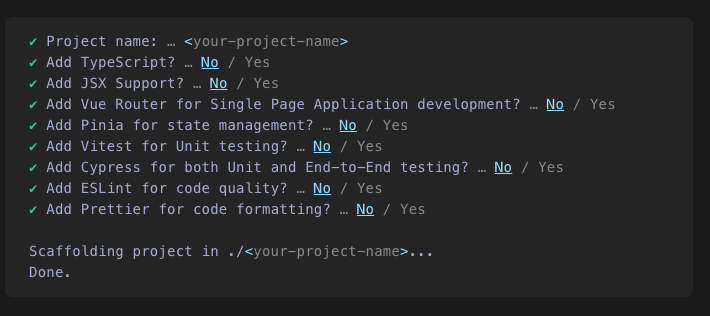

# Overview

This page will attempt to document the high-level considerations of each framework to help determine which will best server the needs of Dynamic Organics. This will not cover the specifics of the development, but will instead focus on overall process – installing, deploying, required libraries, performance, and community considerations – sentiment, support, etc.

## Stats

### Basics 

| Libary | Library Size | Package Listing Size (JSON) | Hot-Reload Engine | Primary Backer | 
|---|---|---|---|---|
| Svelte | | 87K | Vite | [Some Guy](https://vercel.com/blog/vercel-welcomes-rich-harris-creator-of-svelte) | 
| React | | 497K | | Facebook | 
| Vue | | 30K | Vite | [Mr. You](https://en.wikipedia.org/wiki/Vue.js#History) |

### Performance 

| Library | Performance Rating | Performance Ranking |
|---|---|---|
| Svelte | 99.0 | 3 | 
| React | 82.0 (w/Mbox - highest) | 16 |
| Vue | 86.0 | 14 | 

### Usage

| Library | Retention Rate | State of JS Users | Would Not Use % |
|---|---|---|---|
| Svelte | 90% | 2719 | 2.2 |
| React | 84% | 10856 | 13.1 |
| Vue | 80% | 6996 | 10.3 |

## Installation Process

### React

1. `npx create-react-app <app-folder>`
1. `cd <app-folder>`
1. `npm start`
1. Hack away

### Vue

1. `npm init vue@latest`
1. Answer 9 questions

1. `cd <app-folder>`
1. `yarn`
1. `yarn dev`
1. Hack away

### Svelte

1. `npx degit sveltejs/template <app-folder>`
1. `cd <app-folder>`
1. To use Typescript: `node scripts/setupTypeScript.js`
1. `yarn`
1. `yarn dev`
1. Hack away

## References

- [https://procoders.tech/blog/svelte-vs-vue-frameworks-comparison/](https://procoders.tech/blog/svelte-vs-vue-frameworks-comparison/)
- [https://dev.to/hb/react-vs-vue-vs-angular-vs-svelte-1fdm](https://dev.to/hb/react-vs-vue-vs-angular-vs-svelte-1fdm)
- [https://2021.stateofjs.com/en-US/libraries/front-end-frameworks/](https://2021.stateofjs.com/en-US/libraries/front-end-frameworks/)